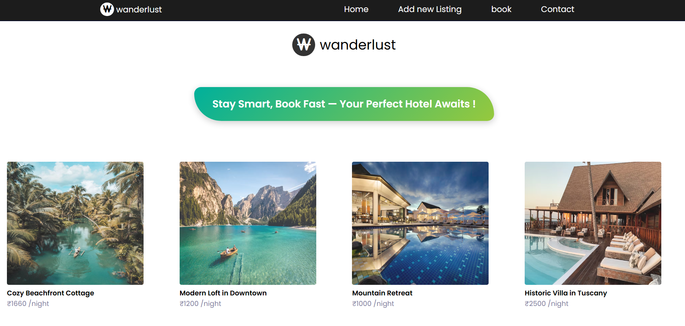
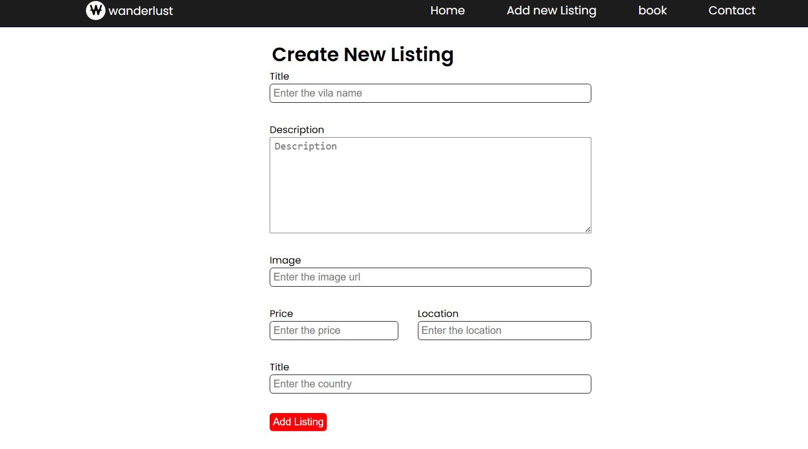
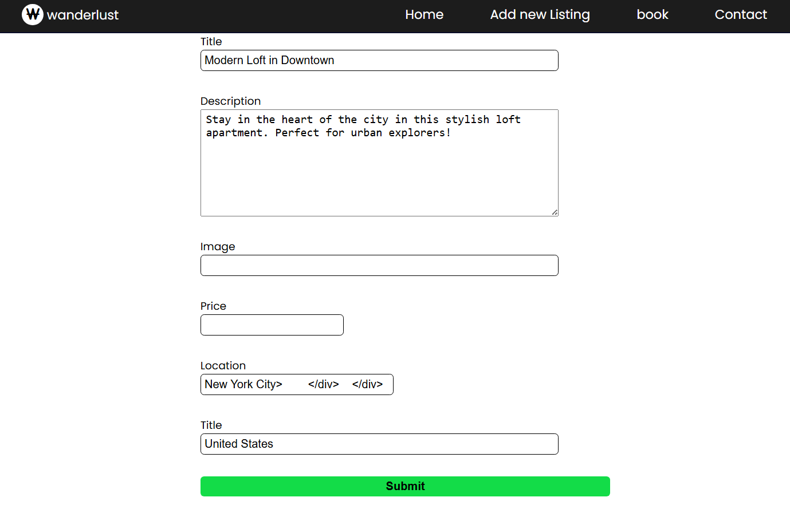
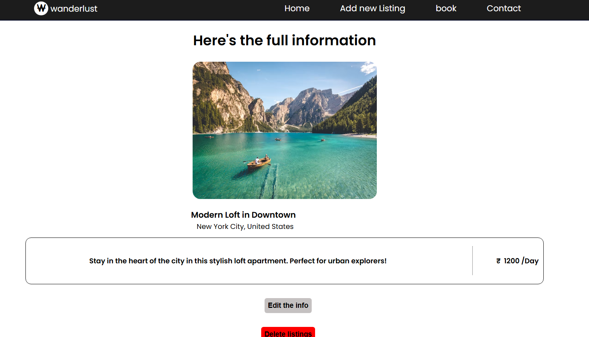
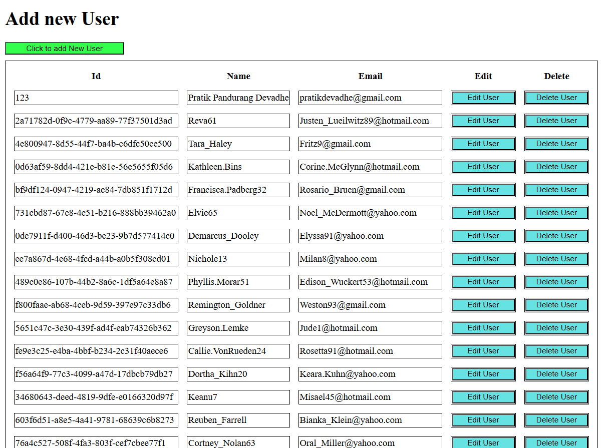
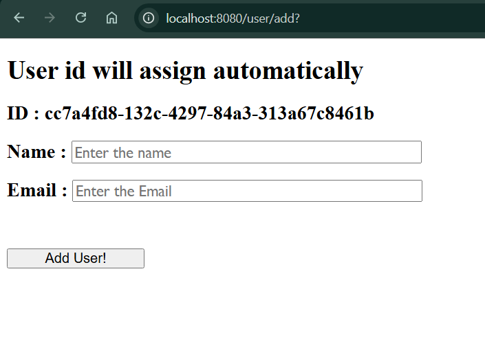
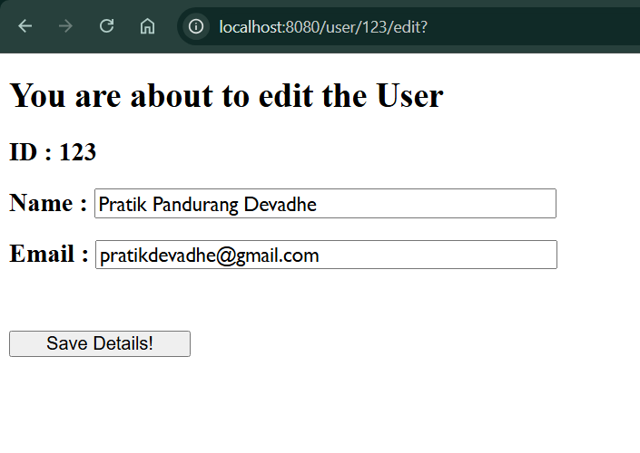

# 🏡 AIRBNB  

This folder contains the **Airbnb Clone Project**, 
It is built using **Node.js**, **Express**, **EJS**, and **MongoDB** to simulate core Airbnb-like functionalities such as creating, editing, and displaying property listings.

---

## 📁 Folder Structure

```
Backend/
│
├── AIRBNB/
│   │
│   ├── init/
│   │
│   ├── module/
│   │   └── schema.js            # MongoDB schema for property data
│   │
│   ├── new/
│   │
│   ├── public/
│   │   └── css/
│   │       └── style.css        # Styling for the project
│   │
│   ├── views/
│   │   ├── layouts/
│   │   │   └── boilerplate.ejs  # Base layout template
│   │   ├── add.ejs              # Add new listing page
│   │   ├── edit.ejs             # Edit existing listing page
│   │   ├── index.ejs            # Main listings page
│   │   ├── show.ejs             # Display individual listing
│   │
│   ├── images/                  # Project screenshots (for documentation)
│   │   ├── listings.png
│   │   ├── edit.png
│   │   ├── new.png
│   │   └── delete.png
│   │
│   ├── ExpressError.js
│   ├── index.js                 # Entry point for the Airbnb server
│   ├── package.json
│   ├── package-lock.json
│   └── README.md

```

---

## ⚙️ Setup Instructions

### 1️⃣ Navigate into the folder
```bash
cd Backend/AIRBNB
```

### 2️⃣ Install dependencies
```bash
npm install
```

### 3️⃣ Run the project
```bash
node index.js
```

Server will run at **http://localhost:8000**

---

## 🧩 Features
- 🏠 View all property listings  
- ➕ Add new listings  
- ✏️ Edit and update existing properties  
- ❌ Delete listings  
- 💾 Uses MongoDB for data storage  
- 🎨 Styled using custom CSS  
- 🧱 EJS templates for dynamic views

---

## 🖼️ Project Screenshots

| View | Preview |
|------|----------|
| 🏠 **Listings Page** |  |
| ➕ **Add New Listing** |  |
| ✏️ **Edit Listing** |  |
| 📋 **Listing Information** |  |


---

## 🛠️ Tech Stack
- **Node.js**
- **Express.js**
- **MongoDB**
- **EJS**
- **CSS**

---


# 🗄️ Databases 

This folder is part of the **Backend** repository and demonstrates how to perform **CRUD operations** (Create, Read, Update, Delete) on a **MySQL database** using **Node.js**, **Express**, and **EJS templates**.

---

## 📁 Folder Structure

```
Backend/
│
├── Databases/
│   ├── images/                  # 📸 Screenshots of project
│   │   ├── home.png
│   │   ├── user.png
│   │   ├── edit.png
│   │   ├── add.png
│   │   ├── delete.png
│   │
│   ├── views/                   # EJS templates
│   │   ├── add.ejs
│   │   ├── edit.ejs
│   │   ├── home.ejs
│   │   ├── user.ejs
│   │
│   ├── index.js                 # Main Express app
│   ├── schems.sql               # Database schema
│   ├── package.json
│   ├── package-lock.json
│
└── node_modules/
```

---

## ⚙️ Key Features

- ✅ MySQL database integration (`mysql2` module)  
- 🧠 Dynamic views using **EJS templates**  
- ✏️ Edit and Update existing records  
- ➕ Add new users  
- ❌ Delete user records  
- 🧰 Uses `method-override` for PATCH & DELETE routes  

---

## 🔗 Main Routes

| Route | Method | Description |
|-------|---------|-------------|
| `/` | GET | Show total number of users |
| `/users` | GET | Display all users |
| `/user/add` | GET | Render form to add a new user |
| `/user/addnew` | POST | Add a new user to the database |
| `/user/:id/edit` | GET | Render edit form for specific user |
| `/user/:id` | PATCH | Update user details |
| `/user/:id/delete` | DELETE | Remove a user from the database |

---

## 🖼️ Project Previews

| View | Preview |
|------|----------|
| 🏠 **Home Page** |  |
| ➕ **Add New User** |  |
| ✏️ **Edit User** |  |


---

## 🧩 Technologies Used

- **Node.js**
- **Express.js**
- **EJS**
- **MySQL2**
- **Faker.js**
- **Method-Override**

---

## 🚀 How to Run

1. Navigate to the project directory:
   ```bash
   cd Backend/Databases
   ```
2. Install dependencies:
   ```bash
   npm install
   ```
3. Start the server:
   ```bash
   nodemon index.js
   ```
4. Open your browser and visit:
   ```
   http://localhost:8080/
   ```

---

# 📸 SOCIAL MEDIA POST VIEWER  (INSTAGRAM)

This folder contains the **Social Media Post Viewer Project**,  
a simple **Node.js + Express + EJS** application that dynamically displays user posts, mimicking a minimal social media feed.  

---

## 📁 Folder Structure  

```
Backend/
│
├── SOCIAL_MEDIA_POSTS/
│   │
│   ├── public/
│   │   └── css/
│   │       └── style.css          # Custom styling for the feed layout
│   │
│   ├── views/
│   │   └── index.ejs              # EJS template for displaying posts
│   │
│   ├── images/                    # Project screenshots (for documentation)
│   │   ├── feed.png
│   │   ├── user_post.png
│   │
│   ├── index.js                   # Entry point for the server
│   ├── package.json
│   ├── package-lock.json
│   └── README.md
```

---

## ⚙️ Setup Instructions  

### 1️⃣ Navigate into the folder  
```bash
cd Backend/INSTAGRAM
```

### 2️⃣ Install dependencies  
```bash
npm install
```

### 3️⃣ Run the project  
```bash
nodemon index.js
```

Server will start at **http://localhost:8080**

---

## 🧩 Features  
- 📱 Displays a collection of user posts  
- 🧑‍🤝‍🧑 Each post includes profile image, name, followers, and content  
- 🎨 Styled using CSS for a clean card-based layout  
- 🧱 EJS templates render dynamic content from the server  
- ⚡ Lightweight and fast Express backend  

---

## 🖼️ Project Screenshots  

| View | Preview |
|------|----------|
| 👤 **User Post View** |  |

---

## 🛠️ Tech Stack  
- **Node.js**  
- **Express.js**  
- **EJS (Embedded JavaScript Templates)**  
- **CSS**

---

## 🧠 Project Overview  

This project serves as a beginner-friendly example of rendering **dynamic data** in **EJS** views using Express.  
It demonstrates how to pass an array of objects (posts) from the backend to the frontend template and display them beautifully.  

---

## 📌 Route  

| Method | Route | Description |
|--------|--------|-------------|
| GET | `/posts` | Renders the EJS template and displays all posts |

---
